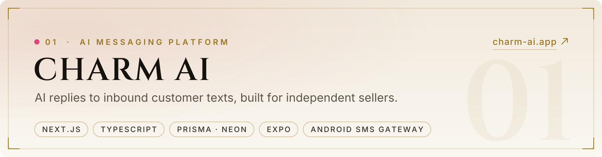
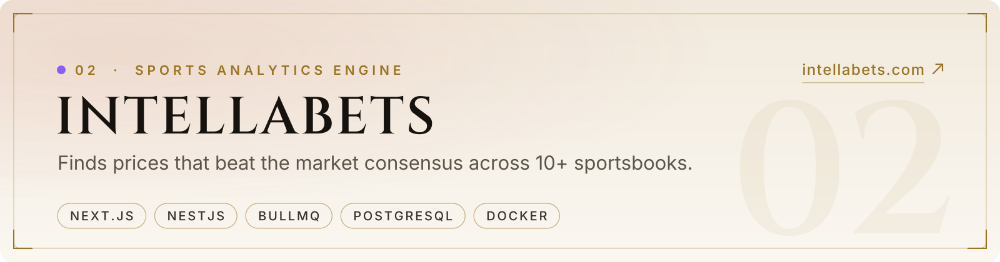

<!--
  GitHub profile README. This repo's name must match the account username for GitHub to show it on the profile page.
  All image paths are relative, so the repo keeps working if the account is renamed (just rename the repo to match).
  All artwork in /assets is generated from code in /design (cd design && npm run build).
  Each image ships in a dark and a light variant; <picture> serves the one that
  matches the visitor's GitHub theme.  is the light-mode fallback.
-->

<picture>
  <source media="(prefers-color-scheme: dark)" srcset="assets/banner-dark.svg">
  
</picture>

  <a href="https://www.linkedin.com/in/dallas-mitchell-caviness"><b>LinkedIn</b></a>
  &nbsp;&nbsp;·&nbsp;&nbsp;
  <a href="https://charm-ai.app"><b>charm-ai.app</b></a>
  &nbsp;&nbsp;·&nbsp;&nbsp;
  <a href="https://intellabets.com"><b>intellabets.com</b></a>

  I build production software from the database up: schema, APIs, web and mobile clients,
  compliance, deployment, and the runbook that keeps it running.

  Sole engineer behind two live products. <b>Open to remote full-stack roles.</b>

 

<picture>
  <source media="(prefers-color-scheme: dark)" srcset="assets/section-shipping-dark.svg">
  
</picture>

<a href="https://charm-ai.app">
  <picture>
    <source media="(prefers-color-scheme: dark)" srcset="assets/card-charm-dark.svg">
    
  </picture>
</a>

- **Web & API:** Next.js + TypeScript on Vercel, Prisma on Neon Postgres. AI reply engine, subscriptions, and a per-provider content storefront.
- **Mobile:** Expo / React Native provider app with an on-device Android SMS gateway.
- **Compliant by design:** replies only to customers who text first. Built around A2P 10DLC, consent and opt-out, with no cold outreach, purchased lists or blasts.

 

<a href="https://intellabets.com">
  <picture>
    <source media="(prefers-color-scheme: dark)" srcset="assets/card-intellabets-dark.svg">
    
  </picture>
</a>

- **The engine:** strips each sportsbook's margin (de-vig), averages 10+ books into a consensus probability, flags prices that beat it, and sizes stakes with capped quarter-Kelly.
- **Architecture:** a NestJS + BullMQ odds-ingestion service on Render (Docker) and a Next.js customer app on Vercel. Each has its own Postgres, and they're bridged by service-to-service auth with entitlements enforced server-side.
- **Guardrails in code:** no fabricated stats, no guaranteed outcomes, 18+ and responsible-gambling language on every customer surface. It publishes analysis only and never takes wagers.

 

<picture>
  <source media="(prefers-color-scheme: dark)" srcset="assets/section-principles-dark.svg">
  
</picture>

- **Own the whole stack.** Schema, API, web, mobile, billing and deploys, held in one mental model with no hand-off gaps.
- **Compliance is a feature.** Consent flows, legal pages and responsible-use rules ship with v1. They aren't bolted on later.
- **Write it down.** Runbooks, launch plans and architecture notes live beside the code, so whoever picks it up next starts with context.
- **Automate the routine.** Scheduled AI-agent runs diagnose, fix and review production code every day, using those docs as shared memory.
- **Honest numbers only.** No invented metrics, testimonials or projections, in product copy or anywhere else.

 

<picture>
  <source media="(prefers-color-scheme: dark)" srcset="assets/section-stack-dark.svg">
  
</picture>

- **Languages:** TypeScript · JavaScript · SQL
- **Front end:** Next.js (App Router) · React · React Native / Expo · Tailwind CSS
- **Back end:** Node.js · NestJS · Prisma · BullMQ · NextAuth · REST / OpenAPI
- **Data:** PostgreSQL (Neon, Render) · Redis
- **Platform:** Vercel · Render · Docker · Git
- **AI:** LLM integration · local inference with Ollama · agent workflows

 

<picture>
  <source media="(prefers-color-scheme: dark)" srcset="assets/footer-dark.svg">
  
</picture>
